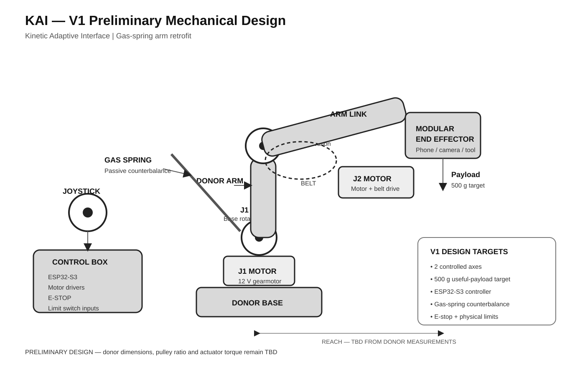

# KAI — Kinetic Adaptive Interface

> A programmable, accessibility-focused desktop arm, designed as a retrofit of an off-the-shelf gas-spring monitor arm.

**STATUS: PRELIMINARY DESIGN / PRE-BUILD.** Nothing has been purchased, built, measured or tested. Every capability below is a design intent or target, not a demonstrated result.



*Rough preliminary design diagram (author). Dimensions, pulley ratio and actuator torque are TBD.*

## Overview

KAI explores whether **large, configurable physical controls** can make it easier to position a phone, small camera or similar object on a desk, without the reach, grip or precision that moving it by hand needs. This is a design hypothesis, not a proven result. See [accessibility](docs/accessibility.md).

Instead of building an arm from scratch, KAI plans to **retrofit an off-the-shelf gas-spring monitor arm**:
- the gas spring provides passive counterbalance;
- the retrofit adds motorized joints, an ESP32-S3 controller, physical controls, a hardware safety system and a modular end effector.

The provisional donor is an NB North Bayou F80-class arm ([donor selection](docs/donor-selection.md)).

## V1 architecture


| Layer | V1 plan |
|---|---|
| Actuated joints | **2:** J1 base rotation, J2 spring-assisted arm (J3 head swivel optional) |
| Controller | ESP32-S3 |
| Inputs | Self-centring joystick, ARM/MODE + SLOW buttons, 3.5 mm jack for two assistive switches |
| Control mode | Jog (velocity) control. Presets need joint sensors and are planned for V2 |
| End effector | Arca-compatible quick-release + ¼"-20 (phone clamp first) |

Details: [architecture](docs/architecture.md) · [V1/V2 scope](docs/v1-v2-scope.md) · [design decisions](docs/decisions.md)

## Mechanical design

The gas spring is expected to carry most of the head's weight, leaving the actuators to handle residual torque, friction and acceleration. This is the key assumption and it is **unmeasured**. Actuator selection is deferred until the donor arm is characterized. A worm-gear DC motor with a belt reduction is the **provisional** choice.

- [Mechanical design](docs/mechanical.md) · [concept diagram](docs/img/mechanical-concept.svg)
- [Torque model](docs/torque-model.md) (parameterized; example values only, clearly labelled)
- [Actuator trade study](docs/actuator-trade-study.md) · [motor-mount concept](docs/img/motor-mount-concept.svg)
- [Donor measurement worksheet](docs/donor-measurements.md) (blank, to be filled in on a real donor)
- [End effector](docs/end-effector.md)

## Electronics

ESP32-S3, one dual H-bridge, and a 12 V actuator rail switched by a relay. The logic supply is separately fused. Ratings are provisional until the actuators are chosen.

- [Electronics plan and pin map](docs/electronics.md) · [diagram](docs/img/electronics.svg)
- [Firmware architecture](docs/firmware.md) (no code yet)
- [Control panel design](docs/control-interface.md)

## Safety

Planned and unverified:
- a hardware E-stop that cuts actuator power independently of the firmware;
- a safe startup state with actuators unpowered;
- fail-safe limit switches;
- a dead-man joystick, speed caps, a stall timeout and a watchdog;
- a fuse and belt slip;
- self-locking worm drives.

Gas-spring snap-up when the payload is removed is treated as a primary hazard. The gas spring is never opened.

- [Safety analysis and hazard register](docs/safety.md) · [safety zones](docs/img/safety-zones.svg)

## Payload target

| Target | Value | Status |
|---|---|---|
| Payload | **~500 g** | **Design target only.** Not measured, not tested, not a specification |
| Reach | ~400–500 mm | Target; the donor's reach is not published |

All candidate donor arms are rated for a minimum of ~2 kg, so a 500 g payload may need head ballast. This is an open question to be answered by measurement. If measurements don't support the target, the target will be reduced.

## Status

| Area | Status |
|---|---|
| Concept, architecture, safety analysis | Drafted |
| Donor arm | Selected provisionally; **not purchased** |
| Measurements | **None taken.** Worksheet prepared |
| Actuators | **Not selected** (blocked on measurements) |
| CAD | Concept drawings only; no CAD model |
| Firmware | Architecture only; no code |
| Hardware | **Not built** |

Full review of what is known, estimated and unknown: [design review](docs/design-review.md).

## Roadmap

| Phase | Goal |
|---|---|
| 0 — Design (current) | Documentation, concept drawings, measurement plan, BOM |
| 1 — Donor characterization | Buy the donor; measure balance, holding torque and friction |
| 2 — Actuators + bench | Select actuators from data; bench-test the E-stop and one joint |
| 3 — Retrofit | Mount J1 and J2; integrate the controller |
| 4 — Feedback | Attachments; informal user feedback, reported honestly |

Funding: Half Life warm-up, **Tier 3, US$100 parts funding** (per the synced [BOM.md](BOM.md)). Preliminary parts estimate: [docs/bom.md](docs/bom.md) (prices not yet verified).

## Repository structure

```
README.md          this file
JOURNAL.md         devlog (synced from Half Life)
BOM.md             parts list (synced from Half Life)
docs/              design documentation
docs/img/          design diagrams (SVG; not photos)
tools/             torque_model.py (example parameters only)
hardware/cad/      CAD status (no models yet)
hardware/electronics/  (no schematic yet)
firmware/          (no code yet)
```

## AI assistance

Much of the documentation, the design diagrams and the torque-model script in this repository were drafted with AI assistance (Claude, and ChatGPT for search). The design direction and decisions are mine, and I am responsible for reviewing and verifying the content. The rough mechanical diagram at the top is my own; the other diagrams are AI-assisted design drawings. All diagrams are design drawings, not photographs or renders of built hardware. Logged hours are recorded in [JOURNAL.md](JOURNAL.md).

## License

Hardware: CERN-OHL-P v2 (planned). Firmware: MIT (planned). Documentation: CC BY 4.0.
