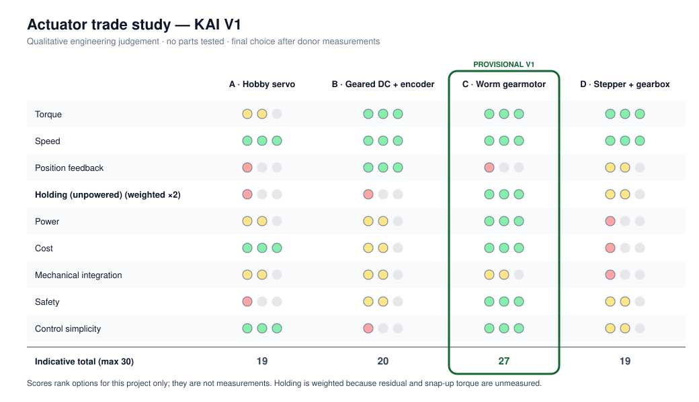

# Actuator Trade Study

> **Qualitative trade study. No actuator has been purchased or tested.** Ratings are engineering judgments based on how each type generally behaves, not measurements of specific parts. **Final selection depends on donor measurements** (M7, M9, M10) and the [torque model](torque-model.md). The per-joint requirement framework is in [actuator-selection.md](actuator-selection.md).

## Options

| | A. High-torque hobby servo | B. Geared DC motor + encoder | C. Worm-geared DC motor | D. Stepper + gearbox |
|---|---|---|---|---|
| Typical form | 20–35 kg·cm class PWM servo | Spur/planetary gearmotor with a quadrature encoder | Low-rpm worm gearbox motor | NEMA17 + planetary gearbox |

## Evaluation

Ratings: ●●● good · ●● acceptable · ● poor, for KAI V1 specifically.

| Criterion | A. Hobby servo | B. Geared DC + encoder | C. Worm gearmotor | D. Stepper + gearbox |
|---|---|---|---|---|
| **Torque** (output, vs. cost) | ●● Limited absolute torque; adequate only if τ_req is small | ●●● Wide choice of ratios | ●●● High output torque from high ratio | ●●● with a gearbox, at higher cost |
| **Speed** (V1 needs only ~3–5 rpm at the joint) | ●●● | ●●● | ●●● Naturally low rpm | ●●● |
| **Position feedback** | ● Internal pot only; the MCU can't read it | ●●● Encoder (relative; needs homing) | ● None unless added | ●● Open-loop steps; missed steps go undetected |
| **Holding behaviour** (vs. residual + snap-up torque) | ● Holds only while powered; hums; drops when power is cut | ● Back-drives when unpowered at moderate ratios; must actively hold | ●●● **Self-locking** (typical of high-ratio worms); holds with zero power | ●● Holds only while energized (holding current, heat) |
| **Power** | ●● Draws current to hold | ●● Draws current to hold against τ_res | ●●● No power to hold; inefficient while moving | ● Continuous holding current |
| **Cost** | ●●● | ●● Encoder versions cost more | ●●● | ● Gearbox + driver cost more |
| **Mechanical integration** | ●● Spline output; 180–270° range limits | ●● Shaft + belt; encoder cabling | ●● Offset output shaft; bulky gearbox; shaft + belt | ● Heavy and long |
| **Safety** | ● Power loss → arm moves; stall heats the servo | ●● Back-drivable (manual override possible); needs current limiting | ●●● Fails holding; belt slip limits force | ●● Missed steps; high holding current; heat |
| **Control complexity** | ●●● PWM only | ● Closed-loop PID | ●●● H-bridge speed + direction (jog) | ●● Driver + accel profiles |

### Why holding behaviour carries the most weight
The [torque model](torque-model.md) example shows a residual torque that varies with angle and **roughly doubles when the device is removed** (snap-up). Without measured data, an actuator that **holds by itself with no power and no control effort** removes the largest unknown from the safety case. This is also the behaviour wanted on E-stop and power loss ([safety.md](safety.md)).

## Provisional V1 recommendation

**Option C: 12 V worm-geared DC motor driving J1 and J2 through a GT2 belt reduction, under jog (velocity) control.**

| Why | Accepted downside |
|---|---|
| Self-locking: holds against τ_res and snap-up with no power | The arm can't be moved by hand while fitted (V2: clutch) |
| Simplest control: one H-bridge channel and a PWM speed per joint | No position feedback, so no presets (V2: joint sensors) |
| Cheapest route to high joint torque | Backlash, noise, low efficiency |
| Belt adds a tunable ratio and an overload slip | The offset shaft makes brackets bulkier |

**Conditions that would change the recommendation:**

| Measurement result | Switch to |
|---|---|
| τ_req at J2 too high for a compact worm gearmotor at practical belt ratios | Larger worm gearmotor, a wiper-type gearmotor, or a linear actuator across the parallelogram |
| M9 shows no rotary mounting space at J2 | Linear actuator across the parallelogram |
| User feedback (V2) strongly values moving the arm by hand | B (geared DC + encoder) with a clutch |
| τ_res turns out small everywhere and J3 is added | A (hobby servo) is acceptable for J3 only |

## Sizing check, to fill in after measurement

| Joint | τ_req (N·m) | Chosen ratio N | Motor rated torque needed (N·m) | Motor rated rpm needed | Stall current (A) | Driver OK? |
|---|---|---|---|---|---|---|
| J2 | UNKNOWN | UNKNOWN | UNKNOWN | UNKNOWN | UNKNOWN | UNKNOWN |
| J1 | UNKNOWN | UNKNOWN | UNKNOWN | UNKNOWN | UNKNOWN | UNKNOWN |
