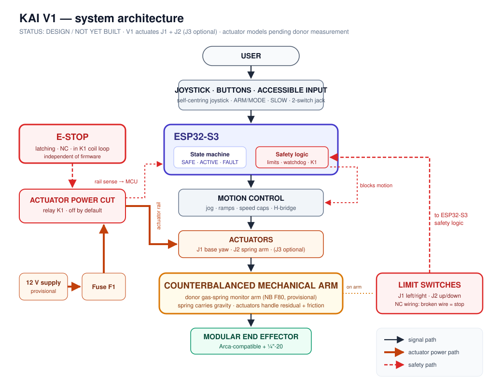

# System Architecture — V1

> Status: **design only.** Nothing has been purchased, built or tested.

## 1. Concept

KAI retrofits an off-the-shelf **gas-spring monitor arm** (preferred: NB North Bayou F80, [donor-selection.md](donor-selection.md)) with motorized joints and accessible physical controls. The gas spring carries most of the head's weight passively. The actuators only need to overcome residual torque, friction and acceleration. This is the central hypothesis, and it is unmeasured.

## 2. V1 scope at a glance

| Layer | V1 | V2 (future) |
|---|---|---|
| Actuated joints | **J1 base yaw, J2 spring arm** (J3 head swivel optional) | + head swivel, head tilt |
| Control | Jog (velocity) via joystick, buttons, switch jack | Presets, closed-loop position |
| Sensing | Limit switches, actuator-rail sense | Joint-angle sensors, current sensing |
| Safety | Hardware E-stop → K1 relay, fuse, limit switches, dead-man input, stall timeout, watchdog, safe startup | + current-based stall detection |
| End effector | Printed Arca-compatible clamp + ¼"-20, phone clamp | Metal clamp, more attachments |

## 3. Paths

The architecture keeps three paths separate, so that a fault in one doesn't silently disable another.

| Path | Route | Detail |
|---|---|---|
| **Signal** | User → joystick / buttons / switches → ESP32-S3 → motion control (ramps, speed caps, limit logic) → H-bridge → actuators → arm → end effector | [firmware.md](firmware.md) |
| **Actuator power** | 12 V supply → fuse F1 → relay K1 (NO) → H-bridge → motors | [electronics.md §2.2](electronics.md#22-actuator-power-path) |
| **Safety** | E-stop (NC) in series with the K1 coil → **actuator power cut in hardware**; limit switches → ESP32-S3 safety task; rail sense → ESP32-S3 | [electronics.md §2.3](electronics.md#23-safety-path-independent-of-firmware) |

The logic supply is separately fused and stays on during an E-stop, so the controller can report state.

## 4. Safety layers

| # | Layer | Independent of firmware? |
|---|---|---|
| 1 | E-stop opens the K1 coil → actuator rail dead | **Yes** |
| 2 | K1 off by default (gate pull-down) → safe startup | **Yes** |
| 3 | Fuse F1 | **Yes** |
| 4 | Belt slip under overload | **Yes** (mechanical) |
| 5 | Self-locking worm drives + gas spring hold the arm when unpowered | **Yes** (expected, to verify) |
| 6 | Limit switches (NC, fail-safe wiring) | No (firmware acts on them) |
| 7 | Dead-man input, speed caps, stall timeout, idle disarm | No |
| 8 | Watchdog → reset → K1 off | Partly |

## 5. Interfaces

| Interface | Type |
|---|---|
| Panel ↔ controller | Keyed multi-pin cable: joystick, buttons, switch jack, E-stop loop |
| Controller ↔ arm | Motor leads (J1, J2), limit-switch harness |
| Arm ↔ attachment | Arca-compatible dovetail + ¼"-20 |
| Host ↔ controller | USB-C serial (configuration, logs) |

## 6. Current unknowns
- Residual torque and friction at J2, and whether ballast is needed (D4, D7, D8).
- Actuator model and ratio (after measurement).
- Space for the brackets at J1 and J2 (D10).
- Force when the head is unloaded (D11).
- Whether jog-only control is acceptable to users without presets.
