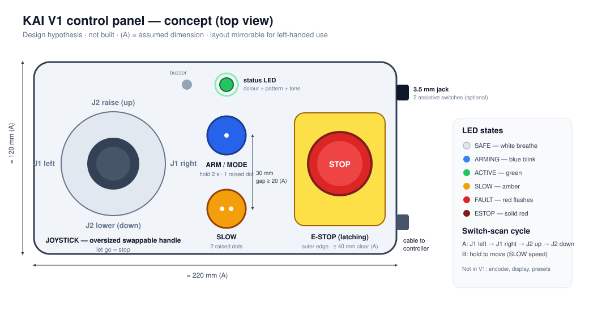

# Control Interface — Physical Panel (V1)

> Status: **design concept.** No panel has been built and no user has tried it. Layout choices are hypotheses ([accessibility.md](accessibility.md)). Dimensions are assumptions (A).

## Panel components

| Element | Part (BOM) | Function | Design notes |
|---|---|---|---|
| **Joystick** | 2-axis analog module + printed oversized handle (E2) | X → J1 swing left/right, Y → J2 raise/lower. Speed ∝ deflection | Self-centring: **let go = stop.** Swappable tops (ball, cup, T-bar) for palm, knuckle or fingertip use |
| **ARM/MODE button** | 30 mm arcade button (E3) | Hold 2 s: arm or disarm. Short press: toggle joystick ↔ switch-scan mode | Raised single dot; adjustable hold time |
| **SLOW button** | 30 mm arcade button (E3) | Toggle 25% speed | Raised double dot |
| **E-stop** | Latching red mushroom on a yellow area (E5) | Cuts actuator power in hardware | Separated ≥ 40 mm (A) from other controls; reachable without reaching past the arm |
| **Feedback indicator** | WS2812 LED + buzzer (E11) | State via colour, pattern and tone | Never colour alone |
| **Assistive-switch input (optional use)** | 3.5 mm TRS jack (E4) | Two standard assistive switches: A = step through actions, B = perform while held | On the panel side so a cable doesn't cross the controls |

Not in V1: rotary encoder, display and presets ([v1-v2-scope.md](v1-v2-scope.md)).

## Layout principles (hypotheses to test)
- **One-handed, no chords.** No function needs two inputs at once.
- **Mirrorable.** The joystick and buttons can swap sides in the enclosure design for left-handed users. The E-stop stays on the outer edge.
- **Large targets, generous spacing.** 30 mm buttons, ≥ 20 mm gaps (A).
- **Separate box on a cable,** placed where the user's hand rests and kept outside the motion envelope ([safety.md](safety.md)).
- **Stable base.** A weighted or non-slip enclosure, so pushing the joystick doesn't move the box.

## Interaction map

| User action | State required | Result |
|---|---|---|
| Hold ARM 2 s (joystick centred) | SAFE | → ARMING → ACTIVE (green) |
| Deflect joystick | ACTIVE | Joint(s) move at a speed proportional to deflection |
| Release joystick | ACTIVE | Motion stops (ramped) |
| Press SLOW | ACTIVE | Toggle 25% speed (amber) |
| Short press ARM | ACTIVE | Toggle joystick ↔ switch-scan |
| Hold ARM 2 s | ACTIVE | → SAFE |
| No input 60 s | ACTIVE | → SAFE (auto-disarm) |
| Press E-stop | Any | Actuator power cut → ESTOP (red) |
| Release E-stop | ESTOP | → SAFE. Must re-arm |

### Switch-scan mode (two switches)
Switch A cycles: **J1 ◀ → J1 ▶ → J2 ▲ → J2 ▼ → (back)**, each announced by an LED colour and a beep count. Holding switch B moves in the highlighted direction at SLOW speed until released.

## Feedback

| State | LED | Tone |
|---|---|---|
| SAFE | Slow white breathe | — |
| ARMING | Blue fast blink | Rising chirp |
| ACTIVE (normal / slow) | Solid green / solid amber | Click on mode change |
| Switch-scan step | Colour per direction | 1–4 beeps |
| At limit switch | Brief red flash | Short low beep |
| FAULT | Red flash code | Repeating triple beep |
| ESTOP | Solid red | One long tone |

## Configurable parameters (over USB, in SAFE only)

| Parameter | Default | Range |
|---|---|---|
| Joystick deadzone | 15% | 10–35% |
| Response curve (expo) | Medium | Linear / medium / strong |
| Max speed J1 / J2 | 30 / 20 °/s | Lower only |
| Long-press time (ARM) | 2 s | 1–5 s |
| Scan beep volume | Medium | Off / low / medium / high |
| Joystick axis swap / invert | Off | — |

## What must be evaluated with users
Can a user arm and jog without instruction? Are the deadzone and speed defaults sensible? Can every participant reach and press the E-stop? Is the switch-scan cycle fast enough to be worth using? ([accessibility.md §4](accessibility.md#4-what-must-be-evaluated-with-real-users))
