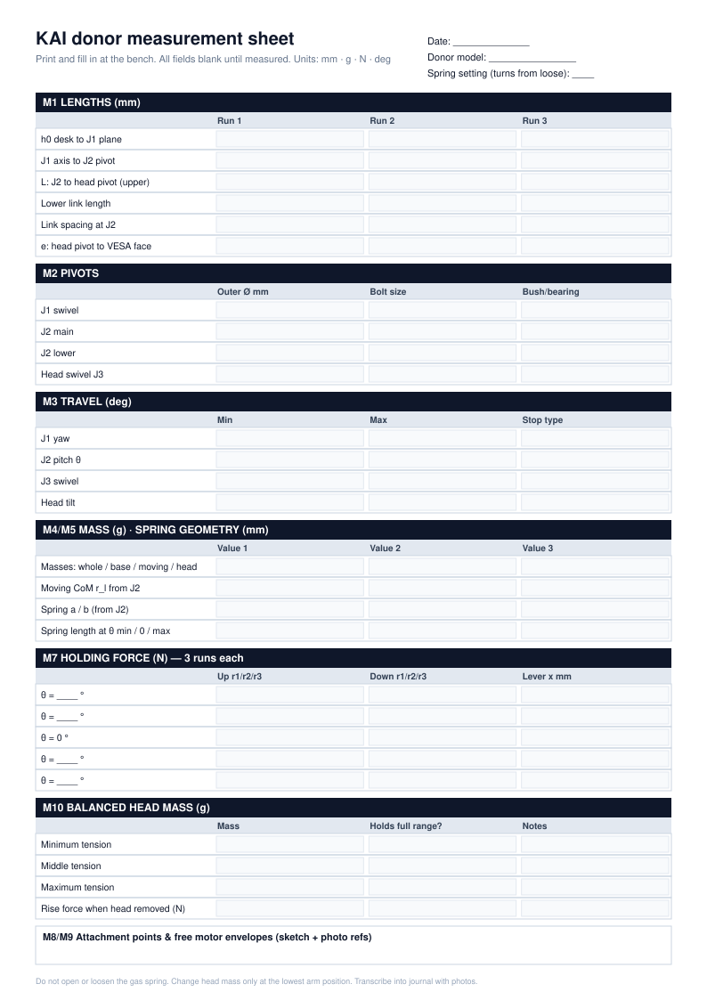

# Donor Measurement Plan & Worksheet

> **No measurements have been taken.** Every value field below is **UNKNOWN** until it is measured on a purchased donor arm. Print [the one-page sheet](img/measurement-sheet.svg) for use at the bench, and transcribe the results into a dated journal entry with photos.

## Equipment

| Item | Use | Have it? |
|---|---|---|
| Steel rule (300 mm) + Vernier/digital calipers | Lengths, pivot diameters | ☐ |
| Kitchen scale (±1 g) | Small parts, attachments, test masses | ☐ |
| Luggage scale or force gauge (±10 g or better) | Holding/break-away forces | ☐ |
| Inclinometer (phone app is acceptable; note which) | Joint angles | ☐ |
| Known test masses (e.g. 250 g, 500 g, 1 kg, 2 kg) | Balanced payload range | ☐ |
| Camera + ruler in frame | Evidence photos, mounting surfaces | ☐ |

**Safety while measuring:** keep fingers out of the parallelogram, never loosen gas-spring fasteners, and change head mass with the arm at its lowest point (see [safety.md](safety.md)).

## Conventions

- J2 angle **θ** is measured above horizontal and is positive when the head rises.
- "Head" means everything beyond the head pivot: VESA plate, any test mass and the clamp.
- Record each force at least **3 times**, in **both directions** where relevant.
- Units are mm, g, N and degrees. Always note the spring tension setting (count screw turns from fully loose).

## M1 — Arm/link lengths

| ID | Quantity | Value | Unit | Method / notes |
|---|---|---|---|---|
| M1.1 | Desk surface → J1 swivel plane (h₀) | UNKNOWN | mm | |
| M1.2 | J1 axis → J2 pivot (horizontal offset) | UNKNOWN | mm | |
| M1.3 | J2 pivot → head pivot, upper parallelogram link (L) | UNKNOWN | mm | Centre to centre |
| M1.4 | Lower parallelogram link length | UNKNOWN | mm | Should equal L |
| M1.5 | Parallelogram link spacing at J2 end | UNKNOWN | mm | |
| M1.6 | Head pivot → VESA plate face (e) | UNKNOWN | mm | |

## M2 — Pivot diameters and fasteners

| ID | Joint | Pivot/cap outer Ø (mm) | Bolt size | Bush or bearing? | Notes |
|---|---|---|---|---|---|
| M2.1 | J1 base swivel | UNKNOWN | UNKNOWN | UNKNOWN | |
| M2.2 | J2 main pivot | UNKNOWN | UNKNOWN | UNKNOWN | Sector-pulley bore depends on this |
| M2.3 | J2 lower link pivot | UNKNOWN | UNKNOWN | UNKNOWN | |
| M2.4 | Head swivel (J3) | UNKNOWN | UNKNOWN | UNKNOWN | |

## M3 — Joint travel

| ID | Joint | Min (°) | Max (°) | Hard stop type | Notes |
|---|---|---|---|---|---|
| M3.1 | J1 base yaw | UNKNOWN | UNKNOWN | UNKNOWN | Watch cable wrap |
| M3.2 | J2 pitch (θ) | UNKNOWN | UNKNOWN | UNKNOWN | Manufacturer: 260 mm vertical head travel |
| M3.3 | J3 head swivel | UNKNOWN | UNKNOWN | UNKNOWN | Manufacturer: ±90° |
| M3.4 | Head tilt | UNKNOWN | UNKNOWN | UNKNOWN | Manufacturer: −30° to +85° |

## M4 — Donor mass

| ID | Part | Mass (g) | Notes |
|---|---|---|---|
| M4.1 | Whole arm as delivered | UNKNOWN | Manufacturer states 2.90 kg; verify |
| M4.2 | Clamp + base (fixed) | UNKNOWN | |
| M4.3 | Moving arm (parallelogram + spring) | UNKNOWN | If separable without touching the spring; otherwise estimate |
| M4.4 | Head assembly (VESA head) | UNKNOWN | |
| M4.5 | Moving-arm CoM distance from J2 (r_l) | UNKNOWN | mm; balance-point method |

## M5 — Gas-spring geometry

| ID | Quantity | Value | Unit | Notes |
|---|---|---|---|---|
| M5.1 | Spring end A: distance from J2 (a) | UNKNOWN | mm | Fixed end |
| M5.2 | Spring end B: distance from J2 (b) | UNKNOWN | mm | Moving end |
| M5.3 | Angle φ between A and B at J2, at θ = 0 | UNKNOWN | ° | |
| M5.4 | Spring length s at θ = min / 0 / max | UNKNOWN / UNKNOWN / UNKNOWN | mm | Measure eye to eye |
| M5.5 | Tension-screw mechanism | UNKNOWN | — | Describe: does it move an end point? |

## M6 — Gas-spring force (only if measurable without opening the spring)

| ID | Quantity | Value | Unit | Notes |
|---|---|---|---|---|
| M6.1 | Spring force at θ = 0 | UNKNOWN | N | **Optional.** Only if it can be inferred externally. Otherwise leave UNKNOWN and use M7 |
| M6.2 | Rated force printed on spring body (if visible) | UNKNOWN | N | Read only; do not remove |

## M7 — Passive holding torque (the key input)

Fixed spring setting: ______ turns from loose. Head mass: ______ g.

| θ (°) | Hold force up, run 1/2/3 (N) | Hold force down, run 1/2/3 (N) | Lever x from J2 (mm) | τ_res (N·m) |
|---|---|---|---|---|
| UNKNOWN (min) | ___ / ___ / ___ | ___ / ___ / ___ | ___ | UNKNOWN |
| UNKNOWN | ___ / ___ / ___ | ___ / ___ / ___ | ___ | UNKNOWN |
| 0 | ___ / ___ / ___ | ___ / ___ / ___ | ___ | UNKNOWN |
| UNKNOWN | ___ / ___ / ___ | ___ / ___ / ___ | ___ | UNKNOWN |
| UNKNOWN (max) | ___ / ___ / ___ | ___ / ___ / ___ | ___ | UNKNOWN |

Convention: an *up* force is needed when the arm sinks, a *down* force when it rises. τ_res = mean(F_up − F_down)/2 × x and τ_f = mean(F_up + F_down)/2 × x, using signed forces as defined in [torque-model.md](torque-model.md).

Also record the friction (break-away) torque at J1 and J3: ______ N at ______ mm radius.

## M8 — Attachment points

| ID | Location | Description (holes, flats, tube Ø) | Usable for | Photo ref |
|---|---|---|---|---|
| M8.1 | Clamp/base body | UNKNOWN | J1 bracket | |
| M8.2 | J2 fixed-side housing | UNKNOWN | J2 motor bracket | |
| M8.3 | Moving upper link near J2 | UNKNOWN | Sector pulley clamp | |
| M8.4 | VESA plate | UNKNOWN | End-effector adapter | |
| M8.5 | Limit-switch striker locations (J1, J2 ends) | UNKNOWN | Limit switches | |

## M9 — Available motor mounting surfaces

| ID | Joint | Free envelope W × H × D (mm), through full travel | Interference noted | Photo ref |
|---|---|---|---|---|
| M9.1 | J1 | UNKNOWN | UNKNOWN | |
| M9.2 | J2 | UNKNOWN | UNKNOWN | |

## M10 — Balanced payload range

| ID | Spring setting | Head mass at which the arm holds still at θ ≈ 0 (g) | Holds across full range? | Notes |
|---|---|---|---|---|
| M10.1 | Minimum tension | UNKNOWN | UNKNOWN | **Answers the ballast question** |
| M10.2 | Middle | UNKNOWN | UNKNOWN | |
| M10.3 | Maximum tension | UNKNOWN | UNKNOWN | |
| M10.4 | Upward force when head mass is removed at the V1 setting | UNKNOWN | — | Snap-up hazard (safety.md H1) |

## Where the results go

| Result | Feeds |
|---|---|
| M1, M4, M5 | [torque-model.csv](torque-model.csv) parameters |
| M7, M10 | τ_res(θ), ballast decision |
| M2, M8, M9 | [motor-mount concept](img/motor-mount-concept.svg) → CAD |
| M3 | Limit-switch placement, firmware soft limits |
| All | [actuator-trade-study.md](actuator-trade-study.md) final selection |
