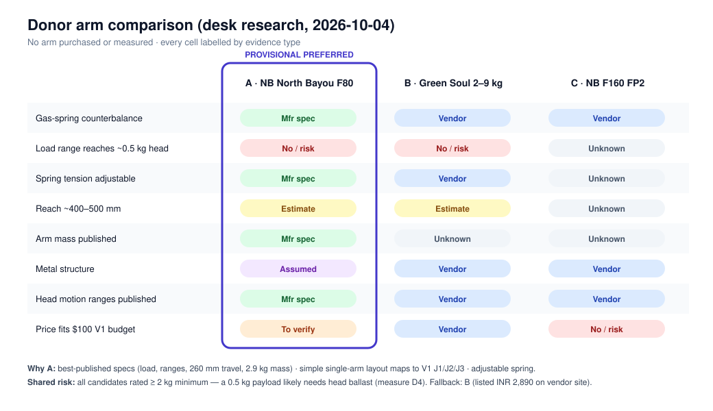

# Donor Arm Selection

> Status: **desk research only.** No arm has been purchased, handled or measured. Specifications below come from manufacturer/vendor pages checked on 2026-10-04; anything else is labelled as an estimate, an assumption or an unknown.

## 1. Selection requirements

| # | Requirement | Why it matters for KAI | Hard / soft |
|---|---|---|---|
| R1 | Gas-spring counterbalance on the main arm | The whole concept: passive gravity balancing | Hard |
| R2 | ~400–500 mm useful reach | V1 reach target | Soft (target) |
| R3 | Rated load that can be matched to KAI's head mass | Spring must balance payload + end effector + head hardware | Hard |
| R4 | Accessible mechanical joints | Brackets and belts must reach the pivots | Hard |
| R5 | Plausible actuator mounting locations near J1 and J2 | Retrofit feasibility | Hard |
| R6 | Robust metal structure | Takes bracket clamping loads and actuator reaction torque | Hard |
| R7 | Adjustable gas-spring tension | Tune balance to KAI's head mass | Soft (strongly preferred) |
| R8 | Price that leaves room for actuators within the funding tier | Donor is the single largest line item | Hard |
| R9 | Retrofit without opening or modifying the gas spring | Stored-energy safety (ADR-018) | Hard |

### The load-range problem (applies to every candidate found)
All candidates found are monitor arms rated for a **minimum of about 2 kg**. KAI's V1 payload target is ~0.5 kg. A spring set at its lowest tension will still push a 0.5 kg head **upward**. V1 therefore assumes the **total head mass** (payload + end effector + head bracket + any actuator at the head + ballast if needed) is brought up to the arm's minimum rated load. This is an **assumption** to be checked on the real arm, because:
- extra head mass increases inertia and impact energy (motion stays slow);
- the remaining spring–gravity mismatch (residual torque) is unknown until measured.

A light-load tablet/laptop gas-spring arm rated near 0.5 kg would avoid this. None with verifiable specifications was found during this research; it remains an open search item.

## 2. Candidates

| | **A. NB North Bayou F80** | **B. Green Soul Single Monitor Gas Spring Stand (13–32", 9 kg)** | **C. NB F160 FP2 (with laptop tray)** |
|---|---|---|---|
| Rated load | 2–9 kg **[M]** | 2–9 kg **[V]** | Up to 9 kg **[V]**; minimum not stated **[U]** |
| Spring tension adjustment | "Fully adjustable gas spring" **[M]** | Built-in tension adjustment **[V]** | Not clearly stated **[U]** |
| Head motion | Tilt −30° to +85°, swivel ±90°, 360° rotation **[M]** | Tilt ±90°, swivel ±90°, rotation ±180° **[V]** | Tilt, swivel, 360° rotation **[V]** |
| Vertical travel | "Upright range 260 mm" **[M]** | Not stated **[U]** | Not stated **[U]** |
| Useful reach | Not stated **[U]**; ~400 mm **[E]** | Not stated **[U]**; ~350–400 mm **[E]** | Not stated **[U]** |
| Arm mass | 2.90 kg **[M]** | Not stated **[U]** | Not stated **[U]** |
| Package size | 41 × 16.5 × 9.5 cm **[M]** | 38 × 15 × 10 cm **[V]** | Not stated **[U]** |
| Material | Not stated on page **[U]**; metal arm **[A]** | Aluminium + steel + plastic **[V]** | "High-grade steel" **[V]** |
| Mounting | C-clamp or grommet **[M]** | C-clamp or grommet **[V]** | Clamp or grommet **[V]** |
| Listed price | **PRICE TO VERIFY** (no verified Indian listing checked) | ₹2,890 on vendor site when checked 2026-10-04 **[V]** — re-verify before purchase | ₹5,490 on vendor site when checked 2026-10-04 **[V]** |
| Documentation quality | Manufacturer spec page with ranges and mass | Vendor page, partial | Vendor page, partial |
| Fit to funding tier | Likely, if price ≈ B **[A]** | Yes (largest single line item) | **No** — ~60% of a $100 budget |

**Legend:** **[M]** manufacturer specification · **[V]** vendor listing · **[E]** estimate (not from a spec sheet) · **[A]** assumption · **[U]** unknown — requires physical measurement.

Sources: [North Bayou F80 product page](https://www.northbayou.co.za/product/f80-gas-strut-desktop-mount/), [Green Soul product page](https://www.greensoul.online/products/green-soul-single-monitor-arms-gas-spring-stand-fits-13-32-screen-9kg-weight-capacity), [NB F160 FP2 listing](https://gadgetwagon.in/products/f160-fp2-17-to-27-inch-gas-strut-led-monitor-desk-arm-with-laptop-tray).

Not shortlisted: heavy-duty arms (e.g. 15 kg-rated), whose minimum load is likely higher still, and premium arms (Ergotron-class), which are outside the budget.

## 3. Provisional preferred donor

**Preferred: A — NB North Bayou F80 (or an equivalent F80-pattern arm). Fallback: B — Green Soul 2–9 kg arm.**

### Why the F80 is the best fit for KAI
1. **Best-documented specifications.** The manufacturer publishes load range, tilt/swivel ranges, vertical travel and arm mass. That is the most starting data of any candidate, and the torque model needs the mass.
2. **Simple single-arm layout.** It has a base swivel at the clamp, one gas-spring parallelogram arm and a multi-axis head. This maps directly onto KAI V1's minimum retrofit: J1 base yaw, J2 spring arm, J3 head swivel, with head tilt and rotation left manual.
3. **Adjustable spring**, required to tune balance to the head mass.
4. **Widely sold design pattern.** If one unit is damaged during retrofit, an equivalent is likely obtainable. This is an assumption about the market, not a verified stock claim.
5. **Moderate cost tier**, provided its verified price is close to candidate B's.

### Why not the others
- **B (Green Soul)** is a good fallback with a confirmed listing price, but its reach, vertical travel and arm mass are not published. It is chosen if F80 pricing or availability doesn't verify.
- **C (F160 FP2)** costs too much for the funding tier, and the laptop tray adds mass KAI doesn't need.

### Risks of the choice
- The 2 kg minimum load (§1) may force ballast at the head.
- Pivot and spring geometry are unknown until the arm is in hand, so bracket designs are concepts only.
- Cheap arms can have play in their pivots, which would hurt repeatability.

## 4. Measurements required before actuator selection

None of these have been performed. Printable worksheet: [donor-measurements.md](donor-measurements.md). Background: [mechanical.md §6](mechanical.md#6-measurements-required-before-actuator-selection).

| # | Measurement | Why |
|---|---|---|
| D1 | Link lengths and pivot locations (J1, J2 parallelogram, head) | Kinematic model, lever arms |
| D2 | Pivot diameters and fastener types | Bracket and pulley interface |
| D3 | Arm/link masses (beyond the published 2.9 kg total) | Gravity torque terms |
| D4 | Head mass at which the arm balances, at min/mid/max spring setting | Confirms or rejects the 2 kg minimum-load concern |
| D5 | Gas-spring attachment points (both ends) relative to J2 | Spring moment-arm geometry |
| D6 | Spring force, **only if measurable without opening the spring** | Spring torque model (otherwise use D7 directly) |
| D7 | Net holding force vs J2 angle at 5–7 angles | Residual torque curve; the key actuator input |
| D8 | Static friction at J1, J2 and head swivel | Friction torque terms |
| D9 | Joint travel limits | Limit-switch placement, soft limits |
| D10 | Free space around J1 and J2 for actuators and belts | Bracket design |
| D11 | Behaviour when the head mass is removed | "Arm rises" hazard magnitude |

## 5. Open items
- Verify F80 price and availability with two Indian vendors.
- Continue searching for a gas-spring arm rated down to ~0.5–1 kg.
- Decide between ballast and spring-only balancing after D4/D7.
