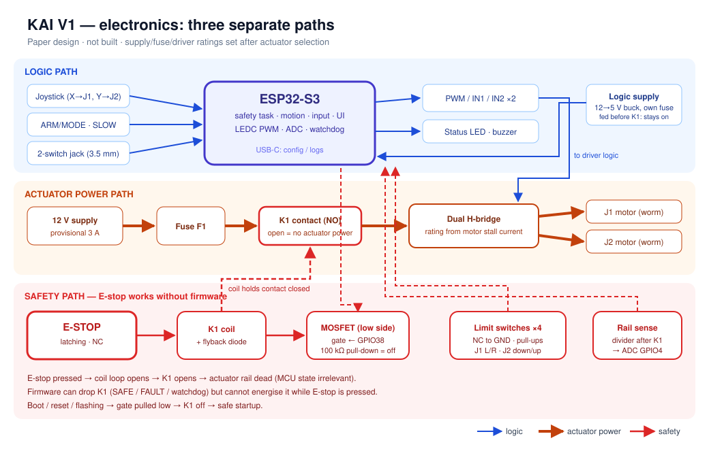

# Electronics — V1

> Status: **paper design.** Nothing has been purchased, wired or tested. Supply, fuse and driver ratings are **provisional** until the actuators are selected ([actuator-selection.md](actuator-selection.md)).



## 1. V1 scope

| Included in V1 | Deferred to V2 (and why) |
|---|---|
| ESP32-S3 dev board | Joint-angle sensors. V1 is jog-only, so presets wait for these |
| Analog joystick (self-centring) | Rotary encoder. Optional; the joystick and buttons cover V1 |
| 2 arcade buttons: **ARM/MODE**, **SLOW** | Dedicated current sensor. Fuse and driver limits cover V1 |
| 3.5 mm TRS jack for two assistive switches | Advanced/current-regulating drivers |
| Limit switches: J1 left/right, J2 up/down | Wireless, telemetry |
| Hardware E-stop with relay cut of actuator power | PCA9685 or extra channels |
| One dual H-bridge driver (J1, J2) | J3 actuator (optional V1 stretch: servo PWM pin reserved) |
| Status LED + buzzer | |

No sensor is added unless V1 needs it to work or to be safe.

## 2. Three separate paths

### 2.1 Logic path
`USB/12 V → buck → 5 V → ESP32-S3 (3.3 V)` and `joystick/buttons/switch jack → ESP32-S3 → driver PWM/DIR`. The logic supply has its own fuse, so actuator faults or E-stop never power down the controller. That way the controller can still report the E-stop state.

### 2.2 Actuator power path
`12 V supply → F1 (fuse) → K1 relay contact (normally open) → driver V+ → J1, J2 motors`

- **Rail voltage: 12 V (provisional)**, matching common worm gearmotors.
- **Supply:** 12 V adapter or enclosed SMPS. Current rating = (sum of rated motor currents) × margin. **Provisional: 12 V, 3 A**, to be revised from the chosen motors' datasheets.
- **F1:** slow-blow, rated just above normal combined running current and below the wiring/driver limit. **TBD** from motor data.

### 2.3 Safety path (independent of firmware)
```
+12 V ── E-STOP (NC, latching) ── K1 coil ── MOSFET drain │ source ── GND
                                              gate ← ESP32 GPIO (100 kΩ pull-down)
```
- **Pressing E-stop opens the K1 coil circuit → K1 opens → actuator rail is dead.** This works whatever the firmware is doing, including if the MCU has crashed or is unpowered.
- The MOSFET is **in series** with the E-stop, so firmware can *drop* actuator power (SAFE, FAULT, watchdog) but **cannot restore it while E-stop is pressed**.
- 100 kΩ gate pull-down: **K1 is off at power-up, reset and during flashing → safe startup state.**
- **Rail sense:** a resistor divider from the switched actuator rail (after K1) to an ADC pin lets firmware see whether actuator power is actually present. This replaces a second E-stop contact. If firmware has commanded K1 on but the rail is absent, it treats that as E-stop or a fault.
- Flyback diode across the K1 coil; K1 contact rated above F1.
- Releasing E-stop does not restart motion. Firmware stays in SAFE until the user deliberately re-arms.

Phase measurement (not done): time from E-stop press to actuator rail collapse. Target < 50 ms.

## 3. Motor driver (provisional)

- **One dual H-bridge module** for J1 and J2. Required: continuous rating ≥ motor rated current, peak ≥ motor stall current, 3.3 V logic inputs.
- Candidates, decided after motor selection: a TB6612-class module (efficient; suits small motors) or an L298N-class module (robust and tolerant, but drops ~2 V and runs warm). The choice depends on the measured/datasheet stall current.
- Worm gearmotors don't back-drive, so no dynamic-braking behaviour is relied on.

## 4. Limit switches

- Lever microswitches at each end of J1 and J2 travel, wired **normally closed to GND with pull-ups**. An open circuit means the limit is hit *or* a wire is broken. Both stop motion in that direction (fail-safe).
- Firmware blocks motion *into* a tripped limit and allows motion *out of* it.
- Backups if a switch fails: the belt slips under overload, the fuse blows, and the E-stop is always available.
- A firmware-independent end-stop (switch + diode in the motor lead) is a V2 option.

## 5. Pin map (ESP32-S3-DevKitC-1, provisional)

| Function | GPIO | Notes |
|---|---|---|
| Joystick X | 1 | ADC1_CH0 |
| Joystick Y | 2 | ADC1_CH1 |
| Actuator rail sense (divider) | 4 | ADC1_CH3; divider scales 12 V to < 3.1 V |
| Joystick push | 5 | Pull-up |
| ARM/MODE button | 6 | Pull-up |
| SLOW button | 7 | Pull-up |
| Alt-input jack tip / ring | 15 / 16 | Pull-ups; standard assistive switches |
| Limit J1 left / right | 17 / 18 | NC to GND, pull-up |
| Limit J2 down / up | 8 / 9 | NC to GND, pull-up |
| Driver J1 PWM / IN1 / IN2 | 10 / 11 / 12 | LEDC PWM ~20 kHz |
| Driver J2 PWM / IN1 / IN2 | 13 / 14 / 21 | LEDC PWM ~20 kHz |
| K1 relay MOSFET gate | 38 | 100 kΩ pull-down |
| Status LED (WS2812) | 39 | Single LED or short strip |
| Buzzer | 40 | |
| J3 servo PWM (optional) | 41 | Reserved |
| Spare | 42, 47, 48 | |

Strapping pins (0, 3, 45, 46) are avoided. Check the exact board revision before wiring.

## 6. Wiring practice
- Star ground at the power distribution point. Logic ground is joined there once.
- Motor and switch cables run separately along the arm where possible. Twist the motor leads.
- Keyed connectors at the arm/controller boundary.
- Wire gauge sized from the F1 rating.

## 7. Failure modes considered

| Failure | Result |
|---|---|
| MCU crash/hang | Watchdog reset → K1 gate pulled low → actuators unpowered; worm drives hold position |
| E-stop pressed | K1 opens in hardware; firmware sees rail absent → ESTOP |
| Limit switch wire breaks | Reads as tripped → that direction blocked |
| Motor stalls | Fuse/driver protection; belt slip; operator releases joystick (dead-man) |
| Relay contact welds | Firmware sees rail present with K1 commanded off → FAULT; E-stop still opens the coil but cannot open welded contacts → **documented residual risk**; mitigated by an adequately rated relay |
