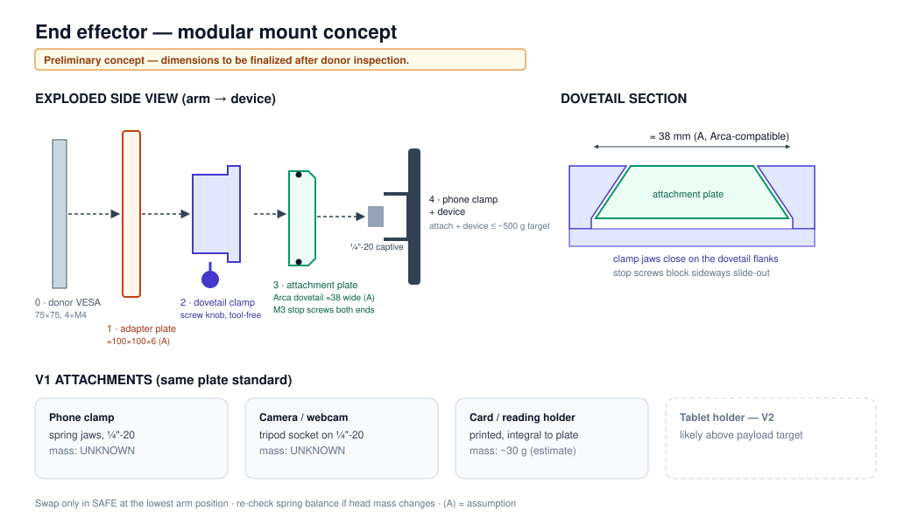

# End Effector — Modular Mount Interface (V1)

> Status: **concept only.** Nothing is printed or purchased. Dimensions marked (A) are assumptions to be confirmed against the donor's VESA plate (M8.4) and against a purchased clamp.

## Goals

| Goal | How |
|---|---|
| Lightweight | Printed PETG plates; small metal content (bolts only) |
| Standard interface | **Arca-Swiss-compatible dovetail** + **¼"-20 UNC** camera thread ([ADR-005](decisions.md)) |
| Easy, tool-free swap | Screw-knob dovetail clamp; attachments slide in and lock |
| Holds a phone, small camera or light object | Interchangeable attachment plates |
| Fails safe | Stop screws so a loosened clamp can't release the plate sideways |

## Interface stack (from the arm outward)

| Layer | Part | Interface | Notes |
|---|---|---|---|
| 0 | Donor VESA plate | VESA 75 × 75 (4 × M4), per donor spec | Existing donor part |
| 1 | **Adapter plate** (printed) | 4 × M4 to VESA; carries the clamp | Spreads load; sets the clamp orientation |
| 2 | **Dovetail clamp** | Arca-compatible jaw, screw knob | V1: printed jaw + knob screw. V2: purchased metal clamp |
| 3 | **Attachment plate** (printed) | Arca-compatible dovetail, ~38 mm wide (A), with **end stop screws** | Each attachment has its own plate |
| 4 | Attachment | Captive ¼"-20 screw, or printed integral holder | Phone clamp, camera, card holder |

## V1 attachments

| Attachment | Interface | Mass, attachment only | Status |
|---|---|---|---|
| Phone clamp (spring-jaw, ¼"-20 socket) | ¼"-20 on attachment plate | UNKNOWN (weigh on purchase) | V1 |
| Small camera / webcam with tripod socket | ¼"-20 direct | UNKNOWN | V1 (uses the same plate) |
| Printed card/reading holder | Integral to plate | UNKNOWN (estimate ~30 g) | V1, printed |
| Tablet holder | ¼"-20 | UNKNOWN | **V2**: likely exceeds the payload target |

**Mass rule:** attachment + device should stay within the ~500 g design target, and every attachment's mass gets recorded. A change in head mass changes the gas-spring balance ([torque-model.md](torque-model.md)), so the spring setting or ballast may need adjusting after a swap.

## Concept dimensions (all assumptions)

| Feature | Value | Basis |
|---|---|---|
| Adapter plate | ≈ 100 × 100 × 6 mm | Covers VESA 75 pattern (A) |
| Dovetail width | ≈ 38 mm | Common Arca-compatible width (A); confirm against the purchased clamp |
| Attachment plate length | ≈ 60 mm | (A) |
| Stop screws | M3, both ends of each plate | Prevent slide-out |
| ¼"-20 screw | Captive, in a counterbore | Standard camera thread |

## Swap procedure (V1)

1. Jog the arm to its **lowest position** and **disarm** (SAFE, actuators unpowered).
2. Support the device with one hand. Loosen the clamp knob.
3. Slide the attachment plate out past the stop-screw path (the clamp must be opened fully).
4. Slide the new plate in until it stops, then tighten the knob. Do a pull test by hand.
5. If the head mass changed a lot, check the balance and adjust the spring or ballast per the attachment's recorded setting.
6. Re-arm.

Rationale: in SAFE the worm drives hold the arm, and doing the swap at the lowest position limits snap-up travel if the balance shifts ([safety.md](safety.md) H1, H9).

## Risks

| Risk | Mitigation |
|---|---|
| Printed dovetail creeps or cracks | PETG, generous wall thickness, inspection; metal clamp in V2 |
| Device slips out of the phone clamp | Choose a clamp with rubber jaws; check the device is secure before arming; low speed |
| Swap changes balance → arm moves | Swap only in SAFE at the lowest position |
| Wrong attachment orientation | Asymmetric plate with an orientation mark |
