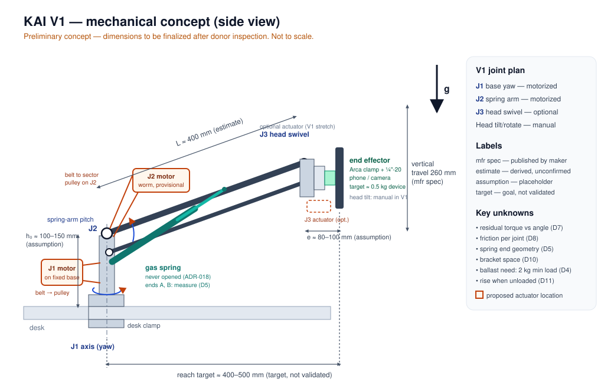

# Mechanical Design — Minimum Viable Retrofit

> Status: **concept and analysis framework only.** No donor arm has been purchased, and nothing has been measured, built or tested. Dimensions are **assumptions** for the preferred donor ([donor-selection.md](donor-selection.md)) and are marked as such.

## 1. V1 scope: minimum viable retrofit

V1 motorizes **only what is needed to demonstrate programmable, accessible repositioning**. The full multi-axis version is future work.

| Joint | Donor motion | V1 status | Rationale |
|---|---|---|---|
| **J1** Base yaw | Arm swivels on the clamp base | **Motorized (V1)**, if a bracket fits at the base (D10) | Sweeps the device left/right |
| **J2** Spring-arm pitch | Gas-spring parallelogram raises/lowers the head | **Motorized (V1, required)** | The core demonstration: actuation working *with* the spring |
| **J3** Head swivel | Head yaws at the arm tip | **V1 stretch / optional** — manual unless time and budget allow | Adds mass at the tip; lowest priority |
| Head tilt / rotation | VESA head | **Manual (V1)**; motorized tilt is V2 | Set once per task |
| End effector | Arca-Swiss clamp + ¼"-20 on VESA plate | **V1** | Modular attachments |

**V1 = 2 actuators (J1, J2).** J3 is an optional third. Any document that mentions "4 actuated joints" is describing V2.

## 2. Design targets — not validated capabilities

| Target | Value | Status |
|---|---|---|
| Payload | **~500 g** device | **Target only.** Not measured, not tested |
| Reach | **~400–500 mm** | **Target only.** The F80's reach is not published; ~400 mm is an estimate |
| J2 speed | ≤ 20°/s | Design limit for safety |
| J1 speed | ≤ 30°/s | Design limit for safety |

If measurements show the targets can't be met within budget, the targets are reduced. The safety factor is not reduced.

## 3. Assumed geometry (preferred donor, to be measured)

| Parameter | Symbol | Value used for concept | Basis |
|---|---|---|---|
| Base height (desk → J2 pivot) | h₀ | ~100–150 mm | **Assumption** |
| Spring-arm length (J2 → head pivot) | L | ~400 mm | **Estimate** (no published reach) |
| Head offset (head pivot → payload CoM) | e | ~80–100 mm | **Assumption** |
| Vertical travel of head | Δz | 260 mm | **Manufacturer spec** ("upright range") |
| J2 pitch range | θ | Roughly ±20–35° about horizontal | **Estimate** from Δz and L |
| Total arm mass | m_arm | 2.90 kg incl. clamp | **Manufacturer spec** — split between links unknown |
| Minimum rated head load | m_min | 2 kg | **Manufacturer spec** |

The parallelogram keeps the head's orientation roughly constant, so the payload's moment arm about J2 is the horizontal distance `L·cos θ + e`.

## 4. Torque-analysis framework (J2)

No gas-spring force or residual torque has been measured, and none is assumed below. The framework defines what to compute once data exists.

### 4.1 Gravity torque about J2

$$
\tau_g(\theta) = g\Big[m_p\,(L\cos\theta + e_p) + m_{ee}\,(L\cos\theta + e_{ee}) + m_h\,L\cos\theta + m_l\,r_l\cos\theta + m_a\,r_a\cos\theta + m_b\,(L\cos\theta + e_b)\Big]
$$

| Symbol | Meaning | Source |
|---|---|---|
| m_p, e_p | Payload mass and CoM offset from head pivot | Target 0.5 kg; device-dependent |
| m_ee, e_ee | End effector (clamp + attachment) | Weigh parts |
| m_h | Head assembly (VESA head, J3 actuator if fitted) | Weigh (D3) |
| m_l, r_l | Moving link mass and its CoM distance from J2 | Measure (D3) |
| m_a, r_a | Any actuator/bracket mounted on the moving link | From design |
| m_b, e_b | Ballast, if needed to reach the spring's minimum load | From D4 |
| θ | J2 angle above horizontal | — |

### 4.2 Gas-spring torque about J2

The spring acts between point A (fixed to the base, distance a from J2) and point B (on the moving link, distance b from J2). With φ(θ) the angle between them at the pivot:

$$
s(\theta) = \sqrt{a^2 + b^2 - 2ab\cos\varphi(\theta)}, \qquad
d(\theta) = \frac{ab\,\sin\varphi(\theta)}{s(\theta)}, \qquad
\tau_s(\theta) = F_s\big(s(\theta)\big)\cdot d(\theta)
$$

- `a`, `b` and φ(θ) come from D5.
- `F_s(s)`, the spring force vs. length, **is unknown**. Gas springs are roughly constant-force with some progression, and the arm's tension screw also changes the effective geometry. It can only be found by measurement (D6), and only without opening the spring.
- **Practical route:** skip modelling `F_s` and measure the **net** torque directly (D7). This is how V1 plans to proceed.

### 4.3 Net static (residual) torque

$$
\tau_{res}(\theta) = \tau_g(\theta) - \tau_s(\theta) \quad\text{or, measured directly:}\quad \tau_{res}(\theta) = F_{hold}(\theta)\cdot x(\theta)
$$

Here `F_hold` is the vertical force needed at the head to hold the arm still, and `x` is that force's horizontal distance from J2. Measure at 5–7 angles, in both directions.

### 4.4 Friction

$$
\tau_f \approx \tfrac{1}{2}\left|\tau_{up,start} - \tau_{down,start}\right|, \qquad \tau_{res} \approx \tfrac{1}{2}\left(\tau_{up,start} + \tau_{down,start}\right)
$$

using the break-away torque measured moving up and moving down at each angle (D8).

### 4.5 Dynamic torque

$$
\tau_{dyn} = I_{J2}\,\alpha_{max}, \qquad I_{J2} \approx \sum_i m_i r_i^2 + I_{links}
$$

V1 accelerations are small (J2 ≤ 20°/s, ramp ≈ 0.5 s, so α_max ≈ 0.7 rad/s²). τ_dyn is expected to be small next to τ_res and τ_f. It is still computed, not assumed.

### 4.6 Required joint torque and motor torque

$$
\tau_{req} = SF\cdot\Big(\max_\theta|\tau_{res}(\theta)| + \tau_f + \tau_{dyn}\Big), \qquad SF = 2\ \text{(provisional)}
$$

$$
\tau_{motor} = \frac{\tau_{req}}{N\,\eta}, \qquad \omega_{motor} = N\,\omega_{joint}, \qquad P_{joint} = \tau_{req}\,\omega_{joint}
$$

where `N` is the transmission ratio (belt stage) and `η` its efficiency. For a worm-gear motor, the gearbox ratio and its low efficiency are already in the motor's rated output torque.

**Variation in payload.** τ_res must be evaluated at the lightest and heaviest head masses expected, for example with and without the device. Removing a 0.5 kg device from a balanced head changes τ_res by about `0.5 · g · (L cos θ + e)`.

### 4.7 Scale check (illustrative, gravity only)

An *unbalanced* 0.5 kg payload at 0.45 m creates about 0.5 × 9.81 × 0.45 ≈ **2.2 N·m** of gravity torque at J2. This is **not** the actuator requirement. The spring is meant to cancel most of it, and the real requirement is τ_req from measured data. The number only shows why an unbalanced design would need a far larger actuator. It is also roughly the torque the actuator must resist if the device is removed while armed (§9).

### 4.8 J1 (base yaw)

With the arm's rotation axis vertical, gravity does no work at J1: `τ_J1 = SF·(τ_f,J1 + I_J1·α)`. Here I_J1 includes the whole arm and head about the base axis, which is large because of the reach, so acceleration ramps matter more at J1 than at J2.

## 5. Actuator locations (concept)

| Joint | Proposed location | Transmission | Notes |
|---|---|---|---|
| J1 | Motor on a bracket clamped to the **fixed base/clamp body**, beside the swivel | GT2 belt to a printed pulley clamped concentric to the swivel | Motor doesn't rotate with the arm |
| J2 | Motor on a bracket on the **base-side link**, near the spring-arm pivot | GT2 belt to a printed pulley/sector fixed to the moving link, concentric with J2 | Motor mass stays near the pivot (small lever arm) |
| J3 (optional) | Small actuator at the head | Direct or short belt | Adds tip mass (counted in m_h) |

Concept bracket: [motor-mount-concept.svg](img/motor-mount-concept.svg). Details: [actuator-selection.md](actuator-selection.md).

**Belt transmission rationale:** it decouples motor alignment from the donor's pivot. Belt tension can be set low enough to slip under an overload, which acts as a mechanical torque limit. The actuator can also be removed without damaging the donor.

## 6. Measurements required before actuator selection

Nothing below has been measured. **Printable worksheet:** [donor-measurements.md](donor-measurements.md) (sections M1–M10 cover D1–D11). **Model to feed:** [torque-model.md](torque-model.md). Equipment needed: luggage scale or force gauge, kitchen scale, steel rule and calipers, inclinometer app, known test masses.

| # | Measurement | Method | Feeds |
|---|---|---|---|
| D1 | **Link lengths** (L, h₀, e) | Rule/calipers, pivot centre to pivot centre | §3, §4.1 |
| D2 | **Pivot locations and pivot diameter** | Calipers; note bolt/bush type | Pulley bore, bracket |
| D3 | **Arm/link mass** (moving link, head) | Weigh removable parts; estimate the link CoM by balancing it on an edge | m_l, r_l, m_h |
| D4 | **Payload at balance** | Add known masses until the arm holds position at min/mid/max tension | Need for ballast |
| D5 | **Gas-spring attachment geometry** (a, b, φ(θ)) | Measure both spring end points relative to J2 at 3+ angles | §4.2 |
| D6 | **Spring force, if measurable** | Only via external measurement with the spring installed; never open it | F_s (optional) |
| D7 | **Passive holding torque** vs angle | Hold force at head × lever, 5–7 angles, up/down, 3 repeats | τ_res(θ) |
| D8 | **Static friction** at J1, J2 and head swivel | Break-away force × radius, both directions | τ_f |
| D9 | **Joint travel** | Inclinometer/protractor at each end stop | Limit switches, soft limits |
| D10 | **Available actuator mounting space** | Photograph with a scale; measure clearances through the full range | Bracket design |
| D11 | **Unloaded rise** | Remove the head mass at balance tension; measure the upward force | Hazard (§9) |

Results go in a dated journal entry with method, raw readings and photos.

## 7. Structure and materials

- Printed brackets and pulleys in **PETG** (ADR-008), at least 4 perimeters on load paths.
- Brackets clamp onto the donor with **U-bolts, split collars or existing fasteners**. No drilling of load-bearing donor parts in V1, and the gas spring is **never** opened (ADR-018).
- Limit-switch strikers are printed and clamped to the moving links.
- Cables run along the arm with service loops at each joint.

## 8. End effector

Arca-Swiss-compatible clamp bolted to the VESA plate. Attachments carry a plate with ¼"-20 thread (ADR-005): phone clamp, small camera, tablet holder (if mass permits), and a printed card holder. Each attachment's mass is recorded, because it changes the head mass and therefore the balance.

## 9. Hazards specific to gas-spring arms

| Hazard | Planned mitigation |
|---|---|
| Arm rises when the device is removed | Swap attachments only in SAFE, at the lowest position; self-locking J2 actuator (provisional choice) holds the arm; D11 quantifies the force |
| Larger reach and mass → pinch and impact energy | Low speed, dead-man joystick, belt slip, limit switches, hardware E-stop |
| Stored spring energy | Never open the spring; adjust only with the manufacturer's tension screw |
| Desk clamp overload | Follow donor clamp instructions; don't add a large ballast mass |

## 10. Future (V2) mechanical work
Motorized head tilt and swivel, joint-angle sensors with magnet mounts, a manual-override clutch, and a light-load donor that removes the need for ballast.
