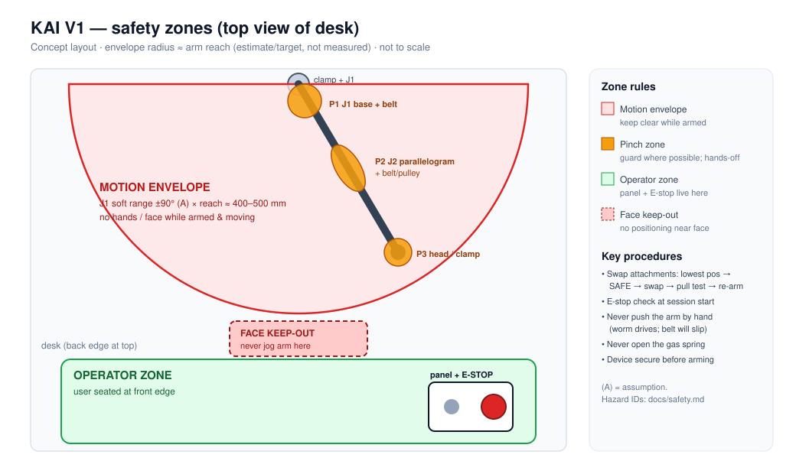

# Safety Analysis

> Status: **design-stage hazard analysis.** Nothing has been built, so no mitigation has been verified. Severity and likelihood are qualitative judgments made before mitigation. Each hazard has a **planned** verification test.

## Scope and assumptions
- The V1 configuration: donor gas-spring arm, J1 and J2 driven by worm gearmotors through belts, jog control, hardware E-stop ([electronics.md](electronics.md)), firmware state machine ([firmware.md](firmware.md)).
- Supervised desk use only. Not for use near the face, and not for feeding ([accessibility.md §6](accessibility.md#6-safety-scope)).
- Ratings: Severity **S1** minor, **S2** moderate injury or damage, **S3** serious. Likelihood **L1** unlikely, **L2** possible, **L3** likely.

## Hazard register

| ID | Hazard | Cause | Consequence | S / L (pre) | Mitigations (design · procedure) | Residual | Planned verification |
|---|---|---|---|---|---|---|---|
| **H1** | **Gas-spring snap-up** | Head mass removed or reduced while the spring is set for a heavier head; or a worm drive or belt fails | Arm rises suddenly, can strike the face or hands, and the device swings | S2 / L2 | Self-locking J2 worm drive holds the arm even unpowered · belt sized not to slip at snap-up torque (torque model "device removed" case) · swap attachments only in SAFE at the lowest position · spring set no stiffer than needed · never open the spring | Belt slip or worm failure during a swap | M10.4: measure the rise force; bench test that the J2 drive holds this force unpowered |
| **H2** | **Unexpected motion** | Firmware bug, stuck input, noisy joystick, motion on arming or power-up | Arm moves without intent | S2 / L2 | K1 off at boot (gate pull-down) · arming needs a 2 s hold with the joystick centred · dead-man joystick with deadzone · speed caps · idle auto-disarm · watchdog | Firmware fault while armed and the joystick held | Power-cycle and reset tests with a logic analyser on K1; joystick-fault injection |
| **H3** | **E-stop not effective** | Wrong wiring, welded relay, E-stop out of reach | Motion continues | S3 / L1 | NC E-stop in series with the K1 coil, independent of firmware · firmware can't re-energise K1 while it's pressed · relay rated above the fuse · rail-sense check flags a welded contact · E-stop on the panel, away from the arm | Welded K1 contact (E-stop can't open it) | Measure press → rail collapse time (< 50 ms target); weekly E-stop function check; welded-contact detection test |
| **H4** | **Power loss** | Mains loss, unplugged supply, fuse blows | Arm drifts or falls | S2 / L2 | Worm drives self-lock · spring balances · resuming power doesn't move anything: K1 stays off and the system boots into SAFE | Drift if a worm back-drives (unlikely at high ratio) | Cut power mid-move with the device fitted; observe drift |
| **H5** | **Actuator stall** | Obstruction, limit switch missed, mechanism binds | Motor or driver overheats; high force on an obstruction (including a hand) | S2 / L2 | Fuse · driver protection · belt slips under overload · stall timeout (continuous drive > 15 s → FAULT) · dead-man input | Force before slip with **no current sensing in V1** | Measure the belt slip torque at the joint; deliberate stall test with a force gauge |
| **H6** | **Pinch points** | Parallelogram scissor gap, belt and pulley nip, J1 sweep against objects | Finger pinch or crush | S2 / L3 | Low speed · belt and pulley guards (printed covers) · avoid scissor gaps where practical · hands-off rule while moving · marked motion envelope | Parallelogram gap inherent to the donor | Inspect each zone with the arm moving slowly; "finger test" checklist |
| **H7** | **Dropped payload** | Clamp loosens, device slips out of the phone clamp, plate slides out | Device falls on the desk, hands or legs | S1–S2 / L2 | Dovetail stop screws · pull test after every swap · rubber-jaw phone clamp · low accelerations · payload target ≤ ~500 g | Device not seated properly by the user | Pull test procedure; shake test at max jog speed |
| **H8** | **Manual movement** | User or helper pushes the arm by hand | Worm drives can't back-drive, so stress on brackets, belts and teeth; the user may assume it moves like a normal monitor arm | S1 / L3 | Label "motorized — don't push"; belt slip protects the gearbox · a clutch for manual override is V2 | Bracket damage if forced | Apply a hand force to the head; check that the belt slips before brackets deflect |
| **H9** | **Attachment changes** | Head mass changes balance; armed during the swap | Snap-up (H1), unexpected motion | S2 / L2 | Procedure: lowest position → SAFE → swap → pull test → re-check balance → re-arm ([end-effector.md](end-effector.md)) · per-attachment spring setting record | Procedure not followed | Swap trial with an observer; checklist sign-off |
| H10 | Electrical | Mains wiring, short circuit, overheated wiring | Shock, fire | S3 / L1 | Enclosed supply/adapter, no exposed mains · fuses on both the actuator and logic feeds · wire sized to the fuse | Low | Supervisor review of wiring before the first power-on |
| H11 | Clamp/tip-over | Desk clamp overloaded by ballast or actuators | Arm detaches or tips | S2 / L1 | Follow the donor clamp rating · minimal ballast · tighten clamp checklist | Low | Check clamp torque before each session |

## Safety zones (see figure)

| Zone | Definition | Rule |
|---|---|---|
| **Motion envelope** | J1 sweep × arm reach, within soft limits | No hands or face inside while armed and moving |
| **Pinch zones** | J2 parallelogram, belts and pulleys, J1 base | Guarded where possible; hands-off |
| **Operator zone** | Panel position, outside the envelope | Panel and E-stop are always reachable from here |
| **Face keep-out** | Head-height region next to the user | The arm is never positioned or jogged here |

## Safe-state definition
**SAFE** means actuator rail de-energised (K1 open), worm drives holding, and the firmware accepting configuration only. Boot, reset, watchdog, any FAULT, idle timeout and E-stop release all lead to SAFE. Leaving SAFE always needs a deliberate 2-second ARM press.

## Open safety questions
- Is the belt slip torque low enough to be safe for fingers, yet high enough to hold the snap-up torque? These two requirements may conflict. H1 and H5 have to be resolved together once M7 and M10 exist.
- Should V1 include a simple current limit despite ADR-011, if the slip torque turns out too high to be finger-safe?
