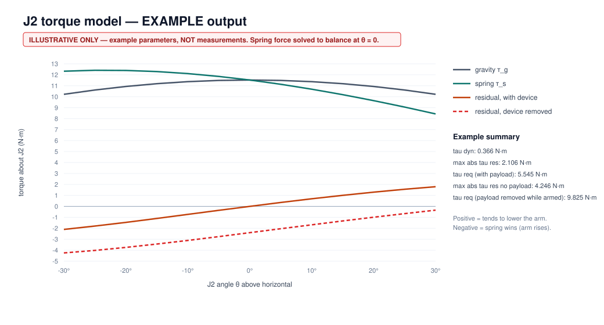

# J2 Torque Model

> **Every number in the example output is an illustrative example, not a measurement.** The model exists so that real donor measurements ([donor-measurements.md](donor-measurements.md)) can be dropped in and an actuator sized from them. Don't size an actuator from the example output.

## Files

| File | What it is |
|---|---|
| [`tools/torque_model.py`](../tools/torque_model.py) | Parameterized model (Python 3, standard library only) |
| [`torque-model.csv`](torque-model.csv) | Output: parameters, summary, and torque vs angle (currently **example values**) |
| [`img/torque-model.svg`](img/torque-model.svg) | Plot generated by the script (labelled EXAMPLE) |

Run it with the example values: `python3 tools/torque_model.py`. To use measured values, put them in a JSON file with the same keys as `EXAMPLE` in the script and run `python3 tools/torque_model.py params.json`.

## Inputs

| Input | Symbol / key | Source once measured |
|---|---|---|
| Payload mass | m_p / `m_payload_kg` | Device to be held (target 0.5 kg) |
| End-effector mass | m_ee / `m_ee_kg` | Weigh clamp + plate ([end-effector.md](end-effector.md)) |
| Head mass | m_h / `m_head_kg` | M4.4 |
| Ballast mass | m_b / `m_ballast_kg` | From M10 (zero if not needed) |
| Moving link mass | m_l / `m_link_kg` | M4.3 |
| Arm length | L / `L_m` | M1.3 |
| Head CoM horizontal offset | e / `e_m` | M1.6 + attachment geometry |
| Link CoM distance | r_l / `r_link_m` | M4.5 |
| Joint angle | θ | Swept over measured travel (M3.2) |
| Gravity | g = 9.81 m/s² | Constant |
| Gas-spring geometry | a, b, φ₀ | M5.1–M5.3 |
| Gas-spring force | F_s / `spring_force_N` | M6 if measurable. Otherwise **bypass the spring model** and use measured τ_res (M7) |
| Friction | τ_f / `tau_friction_Nm` | M7 up/down split |
| Desired acceleration | α / `alpha_rad_s2` | Design choice (20°/s in 0.5 s ≈ 0.7 rad/s²) |
| Safety factor | SF / `safety_factor` | 2 (provisional) |

## Equations

The parallelogram keeps the head's orientation, so the head's lever arm about J2 is `L cos θ + e`.

**Gravitational torque**

τ_g(θ) = g · [ (m_p + m_ee + m_h + m_b)(L cos θ + e) + m_l · r_l · cos θ ]

**Passive spring torque.** The spring runs between point A (a from J2, fixed) and point B (b from J2, moving), with φ(θ) = φ₀ + θ.

s(θ) = √(a² + b² − 2ab cos φ) d(θ) = ab sin φ / s τ_s(θ) = F_s · d(θ)

F_s is treated as constant in the example. A real gas spring has some progression, and the arm's tension screw may move an end point. Both are reasons to prefer the **direct measurement** of τ_res.

**Residual torque**

τ_res(θ) = τ_g(θ) − τ_s(θ) (> 0 the arm sinks; < 0 the arm rises)

Measured directly instead: τ_res = ½(F_up − F_down)·x at each angle (M7).

**Dynamic torque**

τ_dyn = I·α, where I ≈ m_head,total(L + e)² + m_l·r_l²

**Required actuator torque at the joint**

τ_req = SF · ( max_θ |τ_res(θ)| + τ_f + τ_dyn )

This is evaluated for **two cases**: with the device fitted, and with the device removed while the arm is armed. The second case is the snap-up load ([safety.md](safety.md) H1).

**At the motor:** τ_motor = τ_req / (N·η), ω_motor = N·ω_joint, P = τ_req·ω_joint.

## Example output (illustrative only)

Example parameters (none measured): 0.5 kg device, 0.08 kg end effector, 0.35 kg head, 1.1 kg ballast (bringing the head to ~2 kg), 0.9 kg links, L = 0.40 m, e = 0.09 m, spring a = 0.05 m, b = 0.16 m, φ₀ = 95°. The spring force is **solved** so that the arm balances exactly at θ = 0 with the device fitted.

| Example result | Value | What it illustrates |
|---|---|---|
| max \|τ_res\|, device fitted | ≈ 2.1 N·m | Even a "balanced" arm has residual torque away from the balance angle |
| max \|τ_res\|, device removed | ≈ 4.2 N·m | Removing 0.5 kg shifts the whole curve. This is the snap-up load |
| τ_dyn | ≈ 0.37 N·m | Small at V1 speeds, as expected |
| τ_req (SF 2), device fitted | ≈ 5.5 N·m | |
| τ_req (SF 2), device removed while armed | ≈ 9.8 N·m | Sizing for this case roughly doubles the requirement |

**What the example teaches (qualitatively, not numerically):**
1. Residual torque depends on angle, so a single-point balance check isn't enough. M7 needs several angles.
2. The device-removed case can dominate. Either size J2 for it, or make the procedure forbid removing the device while armed (safety.md H1, H9).
3. A belt ratio N of 3 turns an example 5.5 N·m into ≈ 1.8 N·m (≈ 19 kg·cm) at the motor, before efficiency. This shows the method only. Real numbers come from M7.

## Limitations
- Planar, static and quasi-static model. No compliance and no backlash.
- Treats the parallelogram as rigid with an ideal constant-orientation head.
- The spring model is simplified. The measured τ_res supersedes it.
- J1 is not modelled here (no gravity term). Its sizing is friction + inertia ([actuator-trade-study.md](actuator-trade-study.md)).
